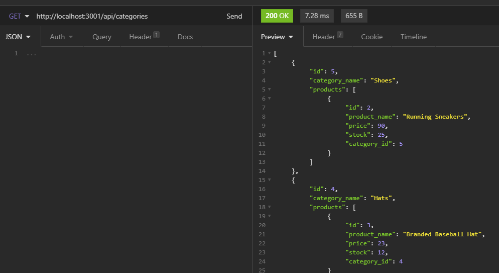
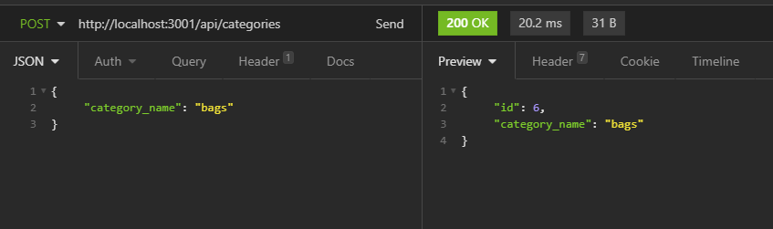
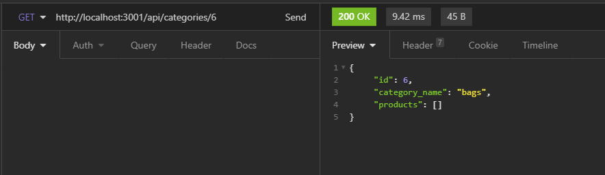
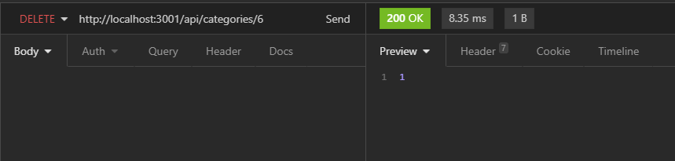

# E-commerce Back End Starter Code

# Note Taker Starter Code

## Purpose
To create a Notepad where one can store, edit and delete data. The project uses express as the server to communicate with the HTML and CSS front-end with the JavaScript and Node.js back-end.

## Built with
* JavaScript
* Node

## npm 
* Express
* dotenv
* sequelize
* express
* routes

## Category

#### Get Categories

#### Create a new Category

#### Get Category by ID

#### Update Category

#### Delete Category by ID

## Relavent links
Walkthrough link: https://drive.google.com/file/d/1HWiMuvherL9isZBzIcscuF6jdaZ_c2Hw/view

Git hub link: https://github.com/Manjula85/e-commerce-Manjula
